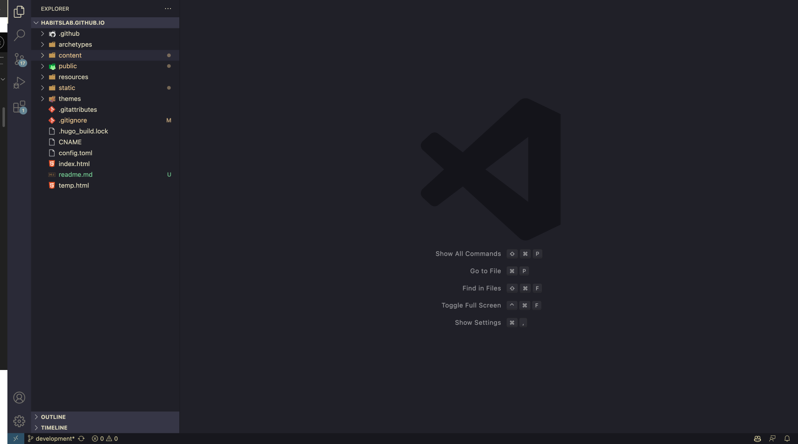
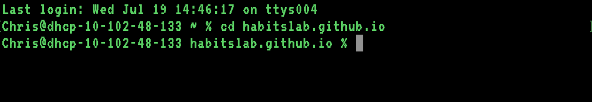
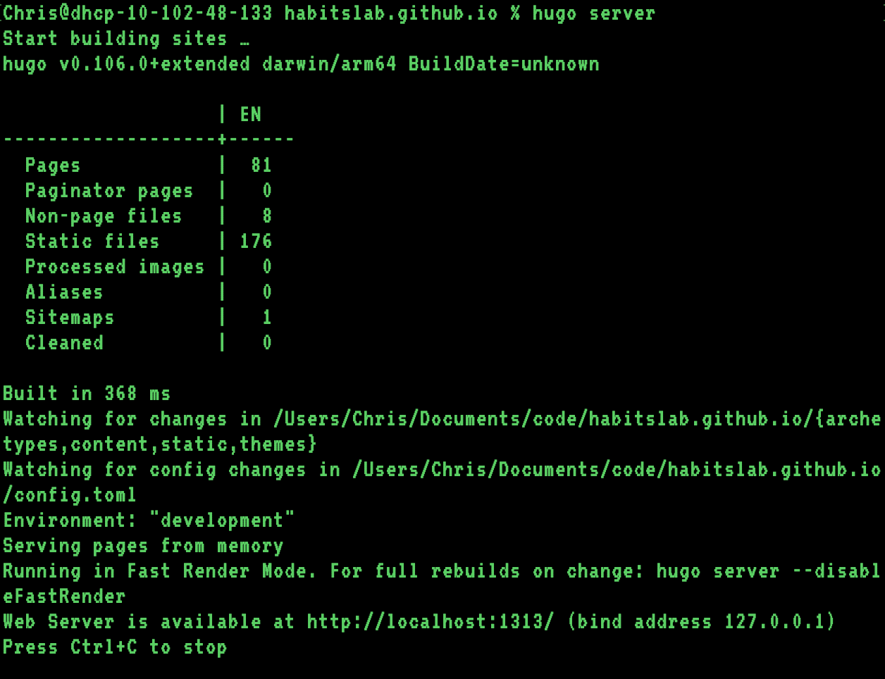
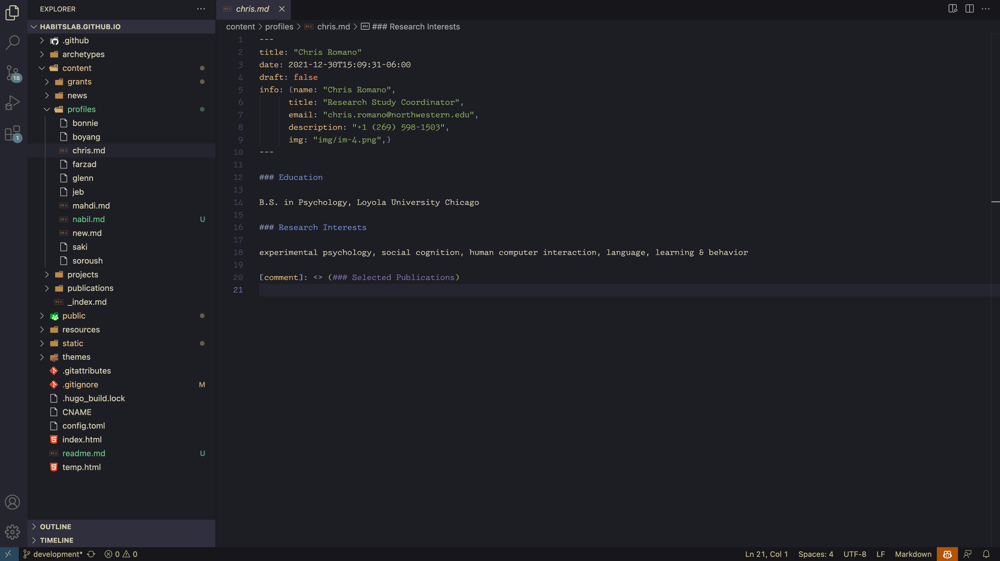
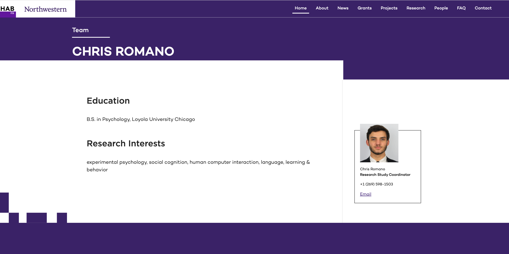
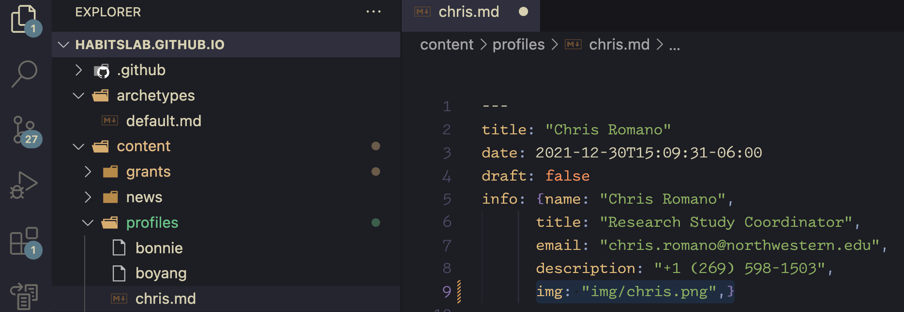
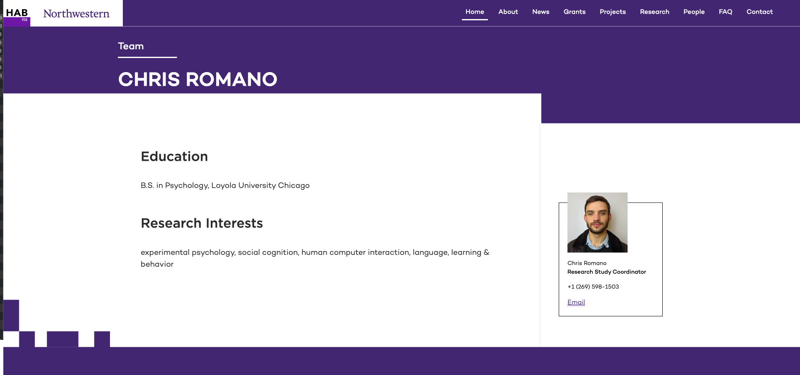

## thehabitslab.com
How to edit

**You will need:**
1. Git/GitHub — [Setup link](https://docs.github.com/en/get-started/quickstart/set-up-git)
2. HABits Lab GitHub access — Contact Jeb via Slack or email `jeb.sumeracki@northwestern.edu`
3. Hugo — [Install link](https://gohugo.io/installation/)
4. A code editor — [VSCode Install link](https://code.visualstudio.com/download) (*recommended*)

### 1. Clone repository

Open your console/terminal and enter the following...

`git clone https://github.com/HAbitsLab/habitslab.github.io.git`

...and press Enter/Return.

This will create a copy of all website files on your computer in the home directory. You will edit these files and then "push" them back to GitHub when you are done.

### 2. Edit files
Open the files to begin editing. If you are using VSCode, open the VSCode application and select `file>open`, navigate to the home directory, select (with a single-click) the folder named `habitslab.github.io`, and click `open`.

In VSCode, the screen will look like this:

**Webpages** are in the `content` folder and media (e.g., images, videos, gifs) are in the `static` folder.

#### Opening a local server (see your edits in real-time)

In your terminal/console, navigate from the home directory into the website directory by entering `cd habitslab.github.io` and pressing Enter/Return. If successful, your terminal should look something like this:

Now, enter `hugo server` and press Enter/Return. Your terminal will tell you the URL of the server, near the bottom like so:

Just above, see the line `Web Server is available at http://localhost:1313/`

Open the URL in a web browser (Chrome, Edge, Firefox, IE, etc.) to view the version of the website that is local to your computer and reflects your edits every time you save a file in the website folder. Your browser should look like this:

#### How to edit webpages

To edit a webpage, find it in the `content` folder and click on it. To give an example, I have opened my own profile page in the image below:

The webpage built from the above code looks like this:

**Markdown Syntax:** The website is written in Markdown. If you are unfamiliar with the Markdown language, consult [this guide](https://towardsdatascience.com/the-ultimate-markdown-cheat-sheet-3d3976b31a0) to learn how to format code in Markdown files — Markdown is very easy to learn.
  

#### How to edit media

Let's say I want to change my profile photo. First, I need to copy the new photo into the website's `img` folder. In my Finder (or File Explorer, if I am using Windows), I navigate from the home directory to the `img` folder via this filepath `Chris/habitslab.github.io/static/img`. I then move/copy the new image file into this folder.

Once I have done that, I edit the webpage code to display the image. I return to the `chris.md` file I opened earlier (my profile page) and, in the 'info' section, edit the filepath to the location of the new image (my new profile picture is called 'chris.png'). See the highlighted line of code below:

Notice that even though the file path of the image is technically `/habitslab.github.io/static/img/chris.png`, I only need to enter `img/chris.png`. This is because the codebase is already configured to assume all media links are in the `static` folder. 

Result: updated profile picture

This is essentially how you will go about editing any media, whether it is inline with the body text or inside a prebuilt layout container like the one shown above.

### Pushing changes to github
In your terminal/console, in the website directory (habitslab.github.io folder), enter the following commands in order:
`git add .`
`git commit -m "updated chris profile photo"`
*note: replace the text in parenthesis with a description of the changes you made*
`git push origin development`

